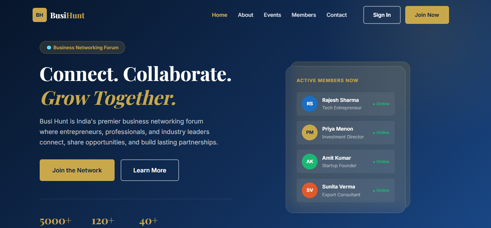
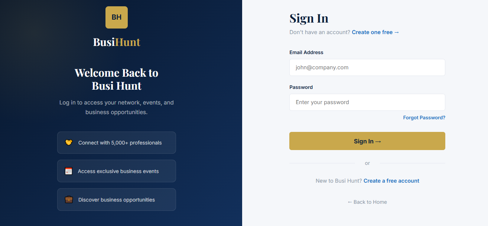
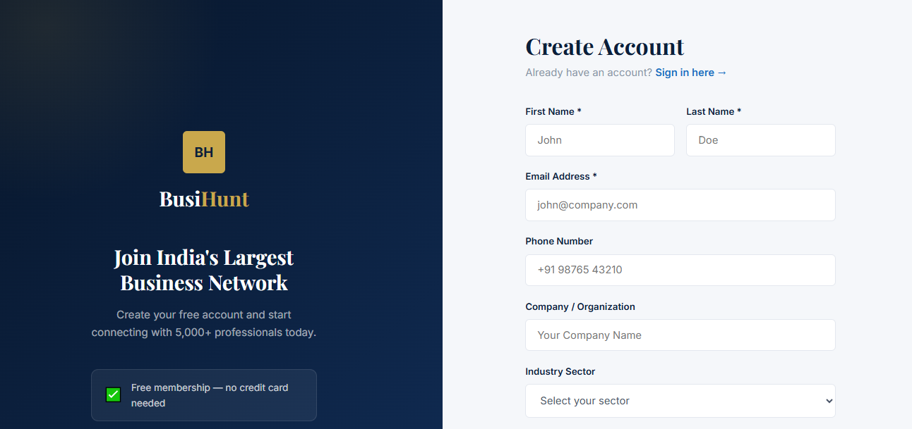
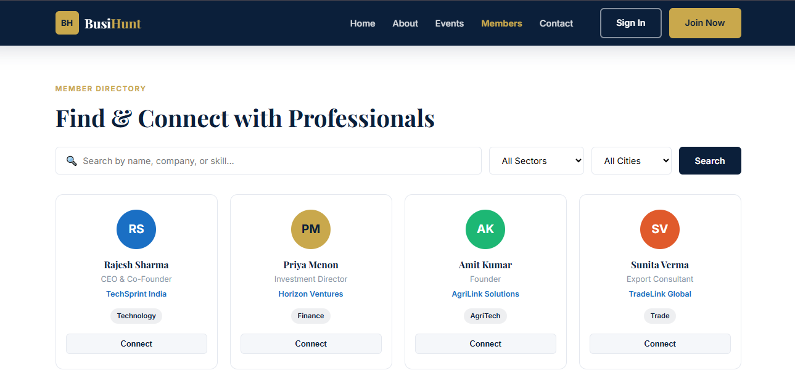
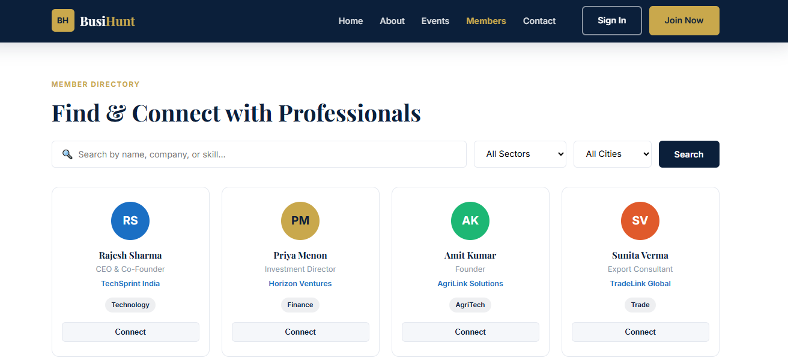
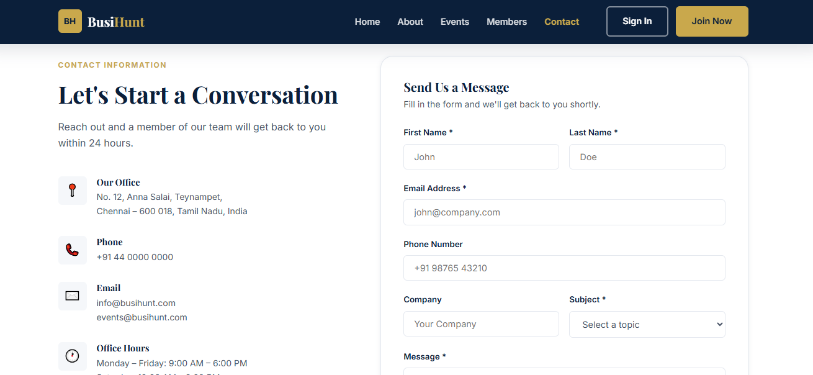
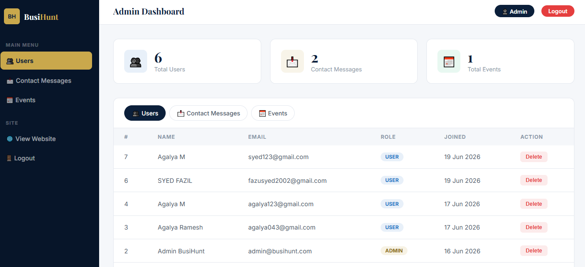

# 🚀 BusiHunt

A modern business networking and event management web application that helps users connect, register, and participate in professional events.

## 📖 Overview

BusiHunt is designed to provide a simple and user-friendly platform where users can:

- Register and create an account
- Login securely
- View upcoming business events
- Contact the administration
- Manage members
- Administer events through an admin panel

The project focuses on clean UI, responsive design, and efficient backend functionality.

---

## ✨ Features

- 👤 User Registration
- 🔐 User Login & Logout
- 📅 Event Management
- 👥 Member Management
- 📞 Contact Form
- 🛠 Admin Dashboard
- 📱 Responsive Design

---

## 🛠 Technologies Used

### Frontend
- HTML5
- CSS3
- JavaScript

### Backend
- PHP

### Database
- MySQL

### Local Server
- XAMPP

### Version Control
- Git
- GitHub

---

## 📂 Project Structure

```
BusiHunt/
│
├── css/
│   └── style.css
│
├── js/
│   └── main.js
│
├── php/
│   ├── config.php
│   ├── login.php
│   ├── register.php
│   ├── logout.php
│   ├── contact.php
│   ├── add_event.php
│   ├── delete_event.php
│   ├── delete_user.php
│
├── index.html
├── login.html
├── register.html
├── members.html
├── events.html
├── contact.html
├── admin.php
└── README.md
```

---

## ⚙️ Installation

1. Clone the repository

```bash
git clone https://github.com/AgalyaHub/BusiHunt.git
```

2. Move the project into the XAMPP `htdocs` folder.

3. Start:

- Apache
- MySQL

from the XAMPP Control Panel.

4. Import the database into phpMyAdmin (if applicable).

5. Open your browser and visit:

```
http://localhost/busihunt
```

---

## 🎯 Objectives

- Build a responsive business networking platform.
- Simplify event management.
- Provide secure authentication.
- Improve user experience with a clean interface.

---

## 📸 Screenshots

### 🏠 Home Page



---

### 🔐 Login Page



---

### 📝 Registration Page



---

### 📅 Events Page



---

### 👥 Members Page



---

### 📞 Contact Page



---

### 🛠️ Admin Dashboard




## 👩‍💻 Author

**Agalya**

GitHub: https://github.com/AgalyaHub

---

## 📄 License

This project is developed for educational and learning purposes.
